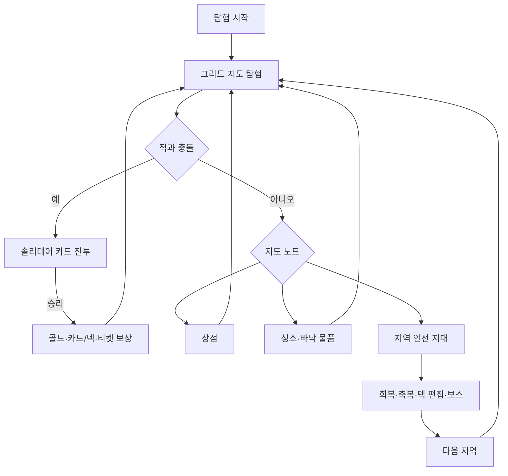

# 현재 게임 규칙

마지막 갱신: 2026-09-14

이 문서는 과거 기획안이 아니라 갱신 당시 **현재 작업 트리에 구현된 규칙**을 설명한다. 세부 수치가 충돌하면 `app/` 코드와 `tests/`를 우선한다.

## 1. 게임의 큰 흐름

핵심은 두 층이다. 지도에서는 제한된 시야 안에서 움직이는 적과 지형을 읽고 경로를 선택한다. 전투에서는 여러 파일에 쌓인 카드를 꺼내 쓰거나 솔리테어 규칙으로 재배열하여 덱의 순서와 효과를 관리한다.

## 2. 지도와 탐험

### 지도 크기와 이동

- 가로 좌표는 `-160~160`이다.
- 총 7개 지역의 틀이 있으며, 모든 지역은 세로 15칸이다.
- 지역 사이에는 단단한 바위 5줄이 있다.
- 플레이어와 적은 상하좌우·대각선을 포함한 8방향으로 이동한다.
- 기본 시야는 플레이어 중심 반경 2, 즉 최대 5×5다. 바위로 연결이 끊긴 칸은 같은 정사각형 안이어도 보이지 않는다.
- 이미 방문한 길을 클릭하면 자동 이동할 수 있다. 새 적이 시야에 들어오면 안전을 위해 자동 이동을 멈춘다.
- 지도 카메라는 드래그 및 확대·축소할 수 있다.

### 일반 지도 생성

| 요소 | 현재 규칙 |
|---|---|
| 상점 | 일반 칸마다 0.25% |
| 추출의 성소 | 일반 칸마다 0.25% |
| 바위 군집 | 일반부 약 3%, 가장자리 약 5% |
| 지역 포탈 | 지역 마지막 줄에서 5%, 없으면 하나 보장 |
| 바닥 물품 | 빈칸마다 1% |

바닥 물품은 카드 80%, 티켓 20%다. 카드인 경우 희귀 5%, 일반 30%, 특별 65% 비율로 풀을 고른다.

지역 포탈은 같은 지역의 안전 지대로 이동시킨다. 안전 지대 포탈은 다음 지역 시작점으로 이동시킨다.

### 오버맵 적

- 새 탐험을 만들 때 유효한 빈칸마다 8% 확률로 일반 적을 미리 배치한다.
- 시작점 반경 2 안에는 일반 적을 생성하지 않는다.
- 1~3지역에만 현재 일반 적 풀이 있다. 4~7지역은 지도 틀만 있고 전투 조우는 없다.
- 적은 3% 확률로 다음 지역 풀에서 조기 출현한다. 다음 풀이 없으면 현재 풀을 쓴다.
- 적 위치는 직접 관측한 칸 단위로 기억된다. 그 칸을 다시 보면 기억을 현재 상태로 갱신한다.
- 플레이어가 적 칸에 들어가거나 적이 플레이어 칸에 들어오면 즉시 전투가 시작된다.

| 표시 | 상태 | 행동 |
|---|---|---|
| `Zzz` | 잠듦 | 이동하지 않는다. 거리 1이면 50%, 거리 2이면 10% 확률로 깨어난다. |
| `?` | 깨어남 | 상태가 유지되면 50% 정지, 50% 무작위 이동한다. 가까우면 같은 확률로 경계 상태가 된다. |
| `!` | 경계 | 90% 확률로 플레이어에게 접근하고 10% 정지한다. 직선거리 4 이상이면 `?`로 돌아간다. |

상태 변화 자체가 그 적의 한 행동을 소비한다. 경계 적은 바위와 다른 적을 반영한 8방향 거리장을 사용한다. 여러 적은 먼저 목적지를 예약하고 동시에 움직이므로 같은 칸에 겹치거나 서로 자리를 맞바꾸지 않는다.

## 3. 안전 지대

- 각 지역에는 일반 지도와 떨어진 별도 안전 지대가 있다.
- 모든 안전 지대에는 축복, 전체 회복, 상점, 다음 지역 포탈이 있다.
- 1~3지역에는 추가로 고정 보스 1명, 회복의 성소 1개, 추출의 성소 2개가 있다.
- 보스는 안전 지대 연결부에 고정되고 처음부터 `!` 상태다.
- 보스가 살아 있는 동안 그 안전 지대에서는 덱 편집을 열 수 없다.
- 전체 회복과 축복 선택은 각 노드에서 한 번만 쓸 수 있다.
- 회복의 성소는 최대 체력의 20%를 회복하고 무너진다.
- 추출의 성소는 덱 하나에서 최대 2장을 바닥으로 꺼낸다. 덱에는 최소 1장이 남아야 하며, 사용 뒤 무너진다.

## 4. 현재 조우 목록

일반 적의 실제 체력은 표시 최대치의 90~100% 범위에서 정해진다. 보스는 고정 최대 체력으로 등장한다.

### 1지역

| 조우 | 최대 체력 | 핵심 행동 |
|---|---:|---|
| 작은 마법사 | 30 | 마법 피해 8 반복 |
| 주황 슬라임 | 40 | 시작 시 유독성 점액 1장 투입. 물리 9와 물리 6+방어 10을 순환 |
| 하수구 쥐 | 40 | 물리 5×2+파일 1장 버리기 / 물리 10+파일 1장 버리기 / 방어 10+힘 3+파일 1장 버리기 |
| 쥐 3마리 | 각 10 | 각자 물리 피해 6 반복 |
| 초록 슬라임 | 40 | 물리 피해 10 또는 물리 피해 10+다음 공격 마법화 |
| 보스: 검은 슬라임 | 70 | 시작 시 유독성 점액 2장. 물리 10 / 방어 10+힘 2 순환 |

### 2지역

| 조우 | 최대 체력 | 핵심 행동 |
|---|---:|---|
| 골렘 | 80 | 대기와 경고 뒤 물리 피해 30을 가하는 고정 패턴 |
| 도깨비 | 66 | 물리 14 / 8×2 / 7×3. 첫 파일 아래에 유물 토큰 투입 |
| 저주술사 | 55 | 마법 6+다음 턴 물리 취약 2, 이후 물리 12·12 |
| 마나 야수+도깨비불 | 55+20 | 야수는 물리 7+마법 7, 불은 공격 없이 다음 턴 마법 취약 1 |
| 작은 마법사 2마리 | 각 30 | 각자 마법 피해 8 반복 |
| 보스: 광대 | 110 | 물리 20 / 마법 20 / 힘 3 행동마다 무작위 파일 5장 버리기 |

### 3지역

| 조우 | 최대 체력 | 핵심 행동 |
|---|---:|---|
| 미라 사제 | 70 | 시작 가호 5. 가호 2+마법 취약 1 / 마법 16 / 물리 20 |
| 미라 전사 | 100 | 매 플레이어 턴 광폭 1. 물리 4×3 / 16 / 5×2+물리 취약 1 |
| 지룡 | 95 | 모든 파일에 흙 1장+물리 취약 1 / 물리 15 / 마법 20 |
| 가시 딱정벌레 2마리 | 각 45 | 가시 4. 물리 취약 / 물리 10 / 플레이어 힘·강인함 각각 -2 중 직전과 다른 행동 |
| 보스: 거대 지룡 | 150 | 첫 행동 파일마다 돌 2장, 이후 돌 1장+힘 4 / 물리 12 / 물리 6×2 |

가호는 피해를 받는 횟수를 막고, 가시는 공격받을 때 플레이어에게 반격 피해를 준다.

## 5. 플레이어와 덱

| 항목 | 기본값 |
|---|---:|
| 최대 체력 | 50 |
| 인벤토리 | 12칸 |
| 보유 덱 케이스 | 최대 3개 |
| 시작 덱 크기 | 16장 |
| 시작 덱 용량 | 20장 |
| 전투 시작 에너지 | 3 |
| 전투 시작 별 | 2 |

시작 덱은 타격 6장, 방어 4장, 마법 방어 2장, 전투 교본·자와 컴퍼스·기회 창출·별의 장막 각 1장이다. 시작 덱에는 에디션이 붙지 않는다.

발견한 덱의 기본 용량은 `20 + 지역 번호 × 5`다. 에디션과 축복이 최종 용량을 바꿀 수 있다.

## 6. 전투와 솔리테어

### 전투 시작과 턴

1. 선택한 덱을 섞어 기본 5장씩 파일에 배치한다.
2. 각 파일의 맨 위 카드만 공개한다.
3. 턴 시작에 비어 있지 않은 각 파일 맨 위에서 한 장씩 손으로 가져온다.
4. 카드를 사용하거나 별을 써서 카드·파일 묶음을 재배열한다.
5. 턴 종료 시 남은 손패를 버리고 적이 행동한다.
6. 다음 플레이어 턴에는 방어를 정리하고 에너지를 회복한 뒤 다시 파일마다 한 장씩 뽑는다.

모든 파일이 비면 버린 카드들을 다시 섞는다. 룰 카드, 이번 전투에서 소멸한 카드와 토큰은 다음 리셔플 대상에서 제외된다.

### 자원과 카드 배치

- 카드 사용은 카드에 적힌 에너지를 쓴다.
- 손패 카드 또는 파일 위쪽의 연속된 카드 묶음을 다른 파일에 놓는 행동은 별 1개를 쓴다.
- 별은 턴마다 자동 회복되지 않는다.
- 파일 배치는 맨 위 규칙, 맨 아래 규칙, 주문 연쇄 규칙을 검사한다.
- 주문 연쇄는 비용이 이어지는 카드로 구성되며, 홍수 피라미드는 4-3-2-1 순서를 사용한다.
- 재련 카드를 조건에 맞는 대상 카드 위에 놓으면 일반 배치와 같은 별 비용을 쓰고, 대상 카드가 그 전투 동안 강화된다.

### 피해·방어·상태

- 플레이어 공격에는 힘이 더해진다.
- 물리 방어와 마법 방어는 서로 다른 적 공격만 막는다.
- 강인함은 획득 방어에 더해진다.
- 물리·마법 저항은 대응 피해를 절반으로 줄이고, 취약은 대응 피해를 두 배로 만든다.
- 같은 속성의 저항과 취약은 서로 상쇄된다.
- 보통 방어는 다음 플레이어 턴에 사라진다. `견고한 태세`가 활성화되면 절반을 유지한다.

### 토큰

| 토큰 | 현재 효과 |
|---|---|
| 유독성 점액 | 사용할 수 없으며 턴 종료 때 손에 있으면 마법 피해 12 |
| 흙 | 사용할 수 없는 파일 방해 카드 |
| 돌 | 사용할 수 없는 파일 방해 카드 |
| 유물 | 사용할 수 없으며 도깨비의 힘을 4 낮춤 |

## 7. 카드 체계

### 핵심 키워드

| 키워드 | 의미 |
|---|---|
| 룰 | 사용 후 버려지지 않고 그 전투의 지속 규칙으로 남음 |
| 소멸 | 사용한 전투의 다음 리셔플에서 제외됨 |
| 재련 | 다른 카드 위에 놓아 그 카드의 전투 중 수치·비용 등을 강화 |

### 시작 카드 3종

| 카드 | 비용 | 효과 |
|---|---:|---|
| 타격 | 1 | 피해 6 |
| 방어 | 1 | 물리 방어 5 |
| 마법 방어 | 1 | 마법 방어 5 |

### 일반 카드 8종

| 카드 | 비용 | 효과 |
|---|---:|---|
| 잽 | 0 | 피해 6 |
| 자와 컴퍼스 | 1 | 피해 9, 별 1 획득 |
| 기회 포착 | 1 | 피해 6, 1장 드로우 |
| 기회 창출 | 1 | 물리 방어 5, 1장 드로우 |
| 휩쓸기 | 1 | 적 전체 피해 9 |
| 정리 타격 | 1 | 피해 9, 선택 파일 맨 위 1장 버리기 |
| 물의 파동 | 1 | 마법 방어 5, 1장 드로우 |
| 별의 장막 | 2 | 물리 방어 12, 별 1 획득 |

### 특별 표시 카드 26종

천문학 연구, 강령학 연구, 금속학 연구, 빛무리, 대형 프리즘, 준비 운동, 별빛, 얼음 방패, 4연격, 전략가, 낡은 노심, 판금 갑옷, 소거법, 무기 연마, 방어구 연마, 질주, 진압, 별의 방주, 응수, 묵직한 한 방, 치환 합금, 청동 철퇴, 철벽, 전투 교본, 거울상, 가호.

- 빛무리: 1코스트. 광채 1장을 손패에 생성한다.
- 대형 프리즘: 3코스트. 광채 3장을 손패에 생성한다.
- 광채: 0코스트 토큰 공격. 기본 피해 4이며, 이번 턴에 먼저 사용한 다른 광채마다 피해가 4 증가한다.

이 그룹에는 룰·소멸·재련, 드로우와 자원 변환, 광역 공격, 반사, 수동 지속 효과 등 전투 구조를 바꾸는 카드가 집중되어 있다. 개별 수치의 단일 기준은 `app/game/cards.ts`의 카드 정의이며, 비용·재련·배치 판정은 `app/game/cardEffects.ts`에 있다.

### 희귀 표시 카드 13종

흑요석 단검, 강철심장, 연사, 전술가, 마도서, 초신성, 유성우, 대분배, 견고한 태세, 법학 연구, 경제학 연구, 광학 연구, 오딘의 창.

- 경제학 연구: 2코스트 룰. 활성화된 장마다 에너지 사용 하한이 -3씩 내려간다.
- 광학 연구: 1코스트 룰. 매 플레이어 턴 시작 시 활성화된 장마다 광채 1장을 손패에 생성한다.
- 턴 시작 에너지는 `min(현재 에너지 + 최대 에너지, 최대 에너지)`로 회복한다. 이 규칙은 추가 턴에도 적용한다.

`흑요석 단검`은 희귀 카드 배열에 정의된 희귀 카드다.

### 전설 카드 6종

호롤로지움, 오피쿠우스, 아리에스, 히드라, 오리온, 카시오페이아가 구현 및 디버그 카드 목록에 정의되어 있다. 그러나 현재 일반 전투 보상, 발견 덱 생성, 상점에는 전설 획득 경로가 연결되어 있지 않다.

`무쇠 난동`은 레거시 배열과 디버그 목록에만 남아 있고 일반 획득 풀에는 연결되지 않는다.

## 8. 덱 에디션

발견 덱은 처음 50% 확률로 에디션을 얻는다. 에디션 하나가 붙을 때마다 다음 판정 확률이 20%p 낮아져 기본적으로 50%→30%→10%가 되며, 중복 에디션은 붙지 않는다. 행운 축복은 각 판정에 10%p를 더한다.

| 에디션 | 효과 |
|---|---|
| 영리한 | 전투 시작 별 +2 |
| 넉넉한 | 빈 파일 1개 추가 |
| 활기찬 | 전투 시작 손에 아드레날린 추가 |
| 환상적인 | 파일당 4장 배치, 덱 용량 10% 감소 |
| 투명한 | 첫 번째 파일의 모든 카드를 공개 |
| 황금빛 | 덱 안 희귀 카드를 모두 공개 |
| 맹렬한 | 전투 시작 에너지 +1, 덱 용량 20% 감소 |
| 탐욕스러운 | 전투 보상 골드 2배 |
| 검소한 | 턴 종료 때 남은 에너지를 별로 전환 |

## 9. 전투 보상과 발견 덱

- 기본 골드는 전투당 15~30이다.
- 탐욕스러운 에디션과 탐욕 축복은 각각 골드를 2배로 만든다.
- 덱 케이스 확률은 25%에서 시작한다. 실패할 때마다 10%p 오르고, 성공하면 25%로 초기화된다.
- 행운 축복은 덱 케이스와 티켓 판정에 각각 10%p를 더한다.
- 덱 케이스가 나오면 독립 카드 보상은 나오지 않는다. 덱 케이스가 없으면 카드 1장을 받는다.
- 카드 희귀 확률은 5%에서 시작한다. 희귀가 아니면 2%p 오르고, 희귀가 나오면 5%로 초기화된다.
- 희귀가 아닌 카드 보상은 일반 약 31.6%, 특별 약 68.4% 비율이다.
- 티켓 보상 확률은 기본 50%다.
- 인벤토리가 가득 찬 보상과 구매품은 현재 지도 바닥에 놓인다.

발견 덱의 각 슬롯은 다음과 같이 생성된다.

| 내용 | 확률 |
|---|---:|
| 빈칸 | 35% |
| 시작 카드 | 15% |
| 일반 카드 | 20% |
| 특별 카드 | 28% |
| 희귀 카드 | 2% |

## 10. 티켓과 상점

| 티켓 | 효과 |
|---|---|
| 색칠 | 덱 카드 한 장의 뒷면을 무지개색으로 변경 |
| 심안 | 20회 이동 동안 시야 거리 +2 |
| 폭탄 | 지도 칸에 설치, 3회 이동 뒤 3×3 범위 적에게 피해 20. 바위는 세 번 맞으면 파괴 |
| 복제 | 카드 또는 티켓 하나를 복제. 전설 카드와 복제 티켓은 복제 불가 |
| 추출 | 위치와 관계없이 덱의 원본 카드 1장을 인벤토리로 추출 |
| 변환 | 카드는 같은 희귀도의 다른 카드로 변환하고, 티켓은 티어와 관계없이 다른 티켓으로 균등 변환. 전설 카드는 변환 불가 |
| 지도 | 같은 지역의 상점·추출 성소·체력 성소 중 가까운 2곳 공개 |
| 카드 팩 | 카드 5장 획득. 현재 상점 전용 상품 |

상점 재고는 서로 다른 특별 카드 3장, 추출 티켓 1장, 서로 다른 무작위 티켓 2장, 카드 팩 1개, 희귀 카드 1장이다. 추출 티켓과 무작위 티켓 2장도 서로 겹치지 않는다. 무작위 티켓은 7종을 균등하게 뽑는다.

가격은 기준가의 80~120% 범위다. 특별 카드 기준가는 50골드, 카드 팩은 100골드, 희귀 카드는 150골드다. 티켓 기준가는 `티어 × 30`골드다.

| 티켓 티어 | 티켓 |
|---:|---|
| 1 | 색칠, 폭탄, 추출, 지도, 심안 |
| 2 | 변환 |
| 3 | 복제 |

## 11. 축복

안전 지대 축복 노드는 아직 얻지 않은 축복 3개를 보여 준다. 후보가 부족하면 효과가 없는 `빈 축복`으로 채운다. 재추첨은 현재 체력 5에서 시작하며 런 전체에서 사용할 때마다 비용이 1 오른다. 이 비용으로 사망할 수 있다.

| 축복 | 효과 |
|---|---|
| 시야 확장 | 시야 거리 +1 |
| 가벼운 발걸음 | 적의 감지 확률 절반 |
| 튼튼함 | 최대 체력과 현재 체력 +20 |
| 탐욕 | 획득 골드 2배 |
| 가방 | 인벤토리 +12, 덱 슬롯 +1 |
| 행운 | 덱·티켓·에디션 획득 확률 +10%p |
| 덱 크기 | 모든 덱 용량 +5 |
| 닌자 | 잠든 적과 전투 시작 시 아드레날린을 손에 추가 |
| 검과 방패 | 전투 시작 시 힘·강인함 +1 |
| 쌍성계 | 전투 시작 시 별 +2 |
| 힐링 마일리지 | 성공적으로 티켓을 사용할 때 체력 2 회복 |
| 금단의 지식 | 전투 밖에서 안전 지대 덱 편집 규칙 사용. 최대 체력은 항상 20. 회복의 성소는 사용·붕괴하지만 회복 효과 없음 |
| 갬블링 | 자신을 제외한 미보유 축복 2개 획득. 부족한 자리는 빈 축복 |
| 한 번 더 | 성공적인 티켓 사용마다 독립적으로 20% 확률로 원본 티켓 보존 |
| 폭탄마 | 폭탄 티켓 8개 획득. 플레이어가 폭탄 피해에 면역 |
| 변환가 | 변환 티켓 4개 획득 |
| 거울상 | 복제 티켓 2개 획득 |
| 골드러쉬 | 골드 300 획득 |
| 가벼운 티켓 | 카드 팩을 제외한 티켓이 인벤토리 칸을 차지하지 않음 |
| 고고학자 | 회복·추출 성소 사용마다 20% 확률로 성소 보존 |
| 하이랜더 | 전투 시작 덱에 같은 효과 카드가 없으면 매 턴 시작 별 +1 |
| 투시 | 최초 배치와 리셔플 때 카드마다 독립적으로 25% 확률로 공개 |
| 대장장이 | 매 턴 첫 재련 시 별 +1 |
| 폭사 방지 | 카드 팩 5장에 희귀가 없으면 마지막 카드를 무작위 희귀로 교체 |
| 생체발광 | 시야 거리 +2, 적에게 인식될 확률 ×1.5 |
| 1UP | 사망 시 최대 체력의 50%(내림)로 한 번 부활. 남은 연타는 계속 처리 |
| 취약 보험 | 취약 피해 배수를 ×1.5(내림)로 변경 |
| 가시 코트 | 전투 시작 시 가시 5 |
| 유리 대포 | 최대 에너지 +1. 모든 물리·마법 저항 획득을 무효화 |

## 12. 덱 편집

- 편집을 열 때 모든 카드의 원래 덱 ID를 기록한다.
- 안전 지대에서는 덱, 인벤토리, 실제 바닥 사이를 자유롭게 옮길 수 있다. 단, 보스가 살아 있는 안전 지대에서는 편집 자체가 잠긴다.
- 안전 지대 밖에서는 원래 덱 카드가 그 덱에 묶인다. 바닥으로 빼면 즉시 실제 바닥에 놓이지 않고 제거 예정이 된다.
- 금단의 지식이 있으면 전투 밖의 모든 지역에서 안전 지대의 일반 덱 이동 규칙을 사용한다.
- 제거 예정 카드는 원래 덱으로만 되돌릴 수 있으며, 편집 확정 시 제거된다.
- 원래 덱이 없는 임시 카드는 같은 편집 중 어느 덱이나 인벤토리·바닥으로 옮길 수 있다.
- 추출 티켓은 편집 시작 당시 덱에 있던 카드에만 쓸 수 있다. 추출한 카드는 원래 덱 제한이 풀린다.
- 덱은 최소 1장을 유지해야 한다.
- 덱 용량과 인벤토리 용량을 넘긴 상태에서는 편집을 확정할 수 없다.
- 카드 판정은 이름이나 배열 순서가 아니라 카드 ID와 덱 ID를 사용한다.

## 13. 기록·디버그·저장

- 디버그 화면에는 전체 카드, 카드 풀 통계, 17개 조우의 적 도감이 있다.
- 텔레메트리는 런, 전투, 턴, 가한·받은 피해, 카드 사용, 카드 획득 경로, 적별 피해, 덱 스냅샷을 기록한다.
- 일부 요약 기록은 브라우저 `localStorage`에 최대 200런까지 남는다.
- 현재 TXT 내보내기는 적별 받은 피해 중심이다.
- 텔레메트리는 세이브 파일이 아니다. 브라우저를 새로고침하면 진행 중인 런은 초기화된다.

## 14. 삭제되었거나 아직 연결되지 않은 것

삭제되어 되살리지 않는 시스템:

- 카드 활성화/비활성화
- 적 열정과 각성
- `발광` 카드
- 물리/마법으로 나뉜 플레이어 공격 피해

정의는 있지만 일반 플레이 경로가 없는 콘텐츠:

- 전설 카드 6종
- 레거시 카드 `무쇠 난동`

아직 콘텐츠가 비어 있는 범위:

- 4~7지역 일반 적과 보스
- 진행 중 런 저장과 불러오기
